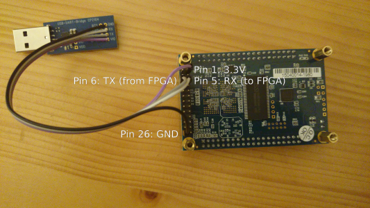

## DE0 Nano Tutorial

If you downloaded the tutorials as a release archive, you can directly
start. If you have cloned the git repository, you instead need to
follow the instructions for building the hardware and software as
described below. Please also follow the
[common tutorial setup](../index.html).

To run the demo you need:

* `quartus_pgm` in your `PATH`, check with

        which quartus_pgm

* `openocd` in your `PATH` and `OPENOCD` set, check with

        openocd --version
        echo $OPENOCD

* `or1k-elf-gdb` in your `PATH`, check with

        or1k-elf-gdb --version

### Setup the board

First you need to setup the board, by connecting the USB cable to your
computer. If you want to use UART, an extra dongle is needed. Any
USB-UART adapter can be used. You need to connect it to the header on
the bottom of the board as depicted below.

### Program the FPGA bitstream

Once the board is setup, you can download the FPGA bitstream by
running

	make program

### Start the OpenOCD daemon

In one terminal execute the following command:

	openocd -s ${OPENOCD}/share/openocd/scripts/ -f interface/altera-usb-blaster.cfg -f ../or1k-dev.tcl 

### Run software with gdb

From a second terminal you can now run gdb, for example to run the
timer example:

	or1k-elf-gdb timer.elf

In gdb execute the following steps:

	target remote :50001
	load
	set $npc=0x100
	continue

You should see the LEDs counting and UART output once a second.

## (Re-)build the hardware

You can rebuilt the hardware by running:

	make build-hw

## (Re-)build the software

Some example software is available, that you can (re-)build for the
DE0 nano board by running

	make build-sw
